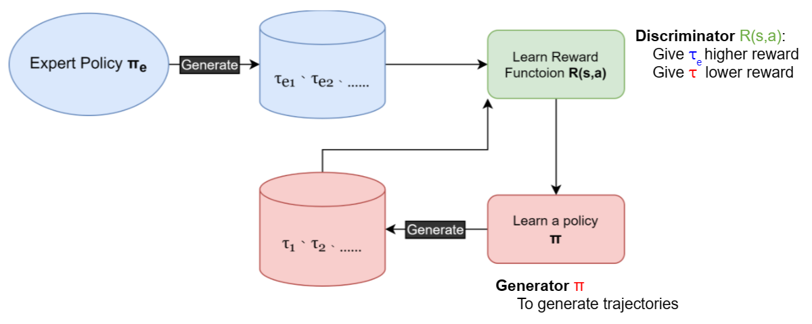
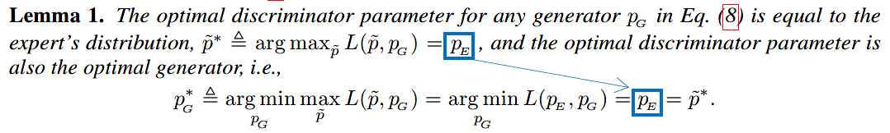
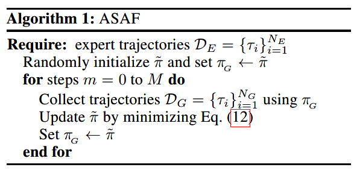
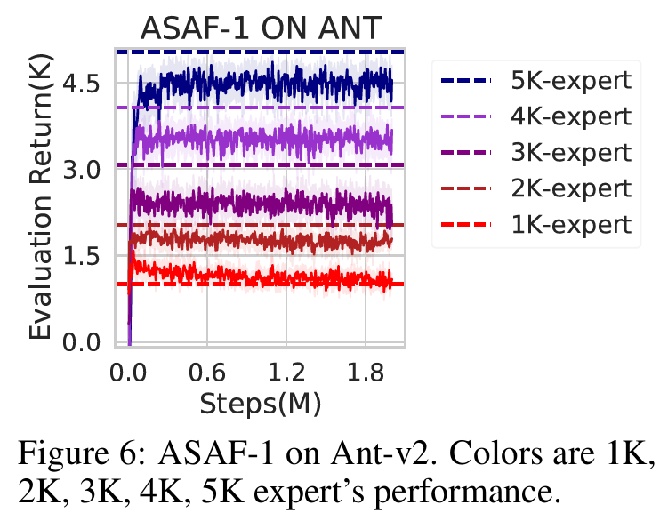
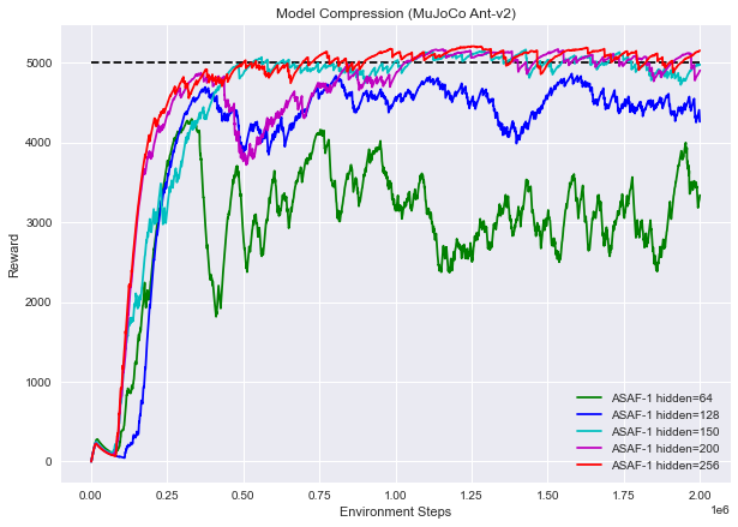
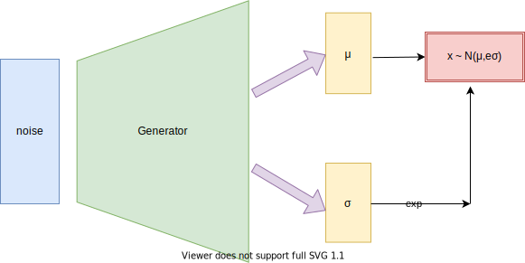

```math
# Adversarial Soft Advantage Fitting 學習筆記

# 簡介ASAF

   **[Adversarial Soft Advantage Fitting (ASAF)](https://arxiv.org/abs/2006.13258)** 是一種**Imitation Learning (IL)**技術，可以透過觀察expert (可以是人類、AI模型... 等)，進而學習模仿expert的行為。

  **與其他IL技術相比，ASAF具有以下幾點特色:** 

- 具有discriminator與generator (即policy)的架構，屬於**Adversarial Imitation Learning (AIL)**的一種。
- 訓練好discriminator的同時，可同時得到訓練好的generator，**省去policy optimization**的步驟。
- 由於沒有policy optimization的步驟，因此訓練過程更加**穩定**且**快速**。

# 何謂**Adversarial Imitation Learning (AIL) ?**



**上圖為AIL的基本架構，其中:**

$$\pi_e: \text{expert policy}, \ \pi: \text{learned policy}, \\
\tau_e: \text{expert trajectory}, \ \tau: \text{generated trajectory}$$

從流程中不難看出，其實R(s, a)的角色就是discriminator區分$\tau_e$與$\tau$，而policy $\pi$ 就是generator試圖產生與expert很像的trajectory去騙過R(s, a)。

也就是因為在AIL訓練過程中，reward function R(s, a)會透過觀察expert的trajectories被訓練出來，我們就再也不必像一般的RL task需要自己設計reward function。

**其實整個過程在做的事情，基本上就是:**

1. 先learn出一個reward function **R(s, a)可以給$\tau_e$ reward越大越好，而給$\tau$ reward越低越好**。
2. 在新訓練出的R(s, a)的基礎上，以**一般RL演算法**訓練更新policy $\pi$。
3. 重複步驟a. b.直至結束。  
<br/>

# 免費的Policy Optimization ?

在簡介中有說，ASAF與一般的AIL不一樣，它無須訓練policy的過程就可得到訓練好的policy，這到底是甚麼神奇的巫術😨 ?  以下就開始討論其數學原理。

## (一) 首先從GAN的optimal discriminator說起:
我們知道GAN的objective的式子如下:
$$L\left(D, G\right) \triangleq \mathbb{E}_{x \sim p_{data}}[\log D(x)]+\mathbb{E}_{x \sim p_{G}}[\log (1-D(x))] $$
並且以此為基礎，經過一些數學證明後我們可得知:
$$D_{p_{G}}^{*} \triangleq \underset{D}{\arg \max } L\left(D, G\right)=\frac{p_{data}}{p_{data}+p_{G}}$$
可以先記住這個optimal discriminator的形式，這會是衍生出後面所有東西的重要基礎 !  
<br/>

## (二) 怎麼不乾脆直接用$D^*_{p_G}$就好😀~

我們知道GAN的objective的式子如下:     

ASAF作者受到一些[**其他AIL論文**](https://arxiv.org/abs/1611.03852)的啟發，決定直接把optimal discriminator的形式拿來model自己假設的discriminator，並稱之為 **structured disciminator** :  ****

$$                L\left(D, G\right) \triangleq \mathbb{E}_{x \sim p_{data}}[\log D(x)]+\mathbb{E}_{x \sim p_{G}}[\log (1-D(x))] $$

$$D_{\tilde{p}, p_{G}}(x)=\frac{\tilde{p}(x)}{\tilde{p}(x)+p_{G}(x)}  $$

並且以此為基礎，經過一些數學證明後我們可得知:

並且再將GAN的objective改寫為: 

$$                D_{p_{G}}^{*} \triangleq \underset{D}{\arg \max } L\left(D, G\right)=\frac{p_{data}}{p_{data}+p_{G}}$$

可以先記住這個optimal discriminator的形式，這會是衍生出後面所有東西的重要基礎 !

$$L\left(\tilde{p}, p_{G}\right) \triangleq \mathbb{E}_{x \sim p_{E}}\left[\log D_{\tilde{p}, p_{G}}(x)\right]+\mathbb{E}_{x \sim p_{G}}\left[\log \left(1-D_{\tilde{p}, p_{G}}(x)\right)\right]$$

其中， $p_E$為真實data ( 即expert行為的distribution ) ，$p_G$生成data ( 即policy行為的distribution )，$\tilde{p}$是learnable的distribution，而discriminator是parameterized by  $\tilde{p}$。我們很快就會看到這麼假設的好處。  
<br>

## (三) 一些好像不怎麼意外的數學卻讓奇蹟發生了 !



到這邊 ASAF的**最核心的引理**終於出現了 !  上面這個**Lemma 1.**用白話文說就是，當去最佳化我們剛得到的新objective $L(\tilde{p}, p_G)$ 時，可以證明optimal $\tilde{p}$ ( 即$**\tilde{p}^***$ )會與真實data的distribution ( 即$p_E$ )是相等的，並且更進一步，還可以證明optimal $p_G$ ( 即$**p_G^***$ )也會等於$p_E$ 。

雖然看似是沒什麼驚喜的結果，但這段數學告訴我們一件很重要的事情，也就是當找到$\tilde{p}^*$的同時，其實我們也**順便**找到了$**p_G^*$，**因為當 $\min_{p_G} \max_{\tilde{p}} L(\tilde{p}, p_G)$被解出時，$**p_G^* = \tilde{p} = p_E**$ 。這也是提供了我們後面證明ASAF可以省去policy optimization這個重要步驟的理論基礎 !

現在看向下面的式子，為了讓policy這個重要角色出來露臉，我們要將$D_{\tilde{p}, p_{G}}(x)$改寫為$D_{\tilde{\pi}, \pi_{G}}(\tau)$:

$$D_{\tilde{\pi}, \pi_{G}}(\tau)=\frac{P_{\tilde{\pi}}(\tau)}{P_{\tilde{\pi}}(\tau)+P_{\pi_{G}}(\tau)}$$

我們知道$P_{\pi}(\tau) = P_0(s_0) \prod_{t=0}^{T-1} \pi(a_t|s_t) P(s_{t+1}|s_t, a_t)$，而$D_{\tilde{\pi}, \pi_{G}}(\tau)$分子分母可將$P_0(s_0) \prod_{t=0}^{T-1} P(s_{t+1}|s_t, a_t)$約分掉，從而使得$D_{\tilde{\pi}, \pi_{G}}(\tau)$最後的形式變成了每個項都是一條trajectory中的policy機率值連乘，相當簡單易懂:

$$D_{\tilde{\pi}, \pi_{G}}(\tau)=\frac{q_{\tilde{\pi}}(\tau)}{q_{\tilde{\pi}}(\tau)+q_{\pi_{G}}(\tau)} \ , \ \text{其中 } q_{\pi}(\tau) \triangleq \prod_{t=0}^{T-1} \pi\left(a_{t} \mid s_{t}\right)$$

最後，透過Lemma 1.我們得到最重要的結論:

$$\qquad \qquad \quad \ \ (a) \quad \tilde{\pi}^{*} \triangleq \underset{\tilde{\pi}}{\arg \max } L\left(\tilde{\pi}, \pi_{G}\right)  \ \text{satisfies} \ \ q_{\tilde{\pi}^{*}} = q_{\pi_{E}}\\ 
(b) \quad \pi_{G}^{*}=\tilde{\pi}^{*} \in \underset{\pi_{G}}{\arg \min } L\left(\tilde{\pi}^{*}, \pi_{G}\right)$$

# ASAF演算法

**以下就是整個演算法流程，可以看出少了policy optimization讓整個流程變得相當簡潔。**



而演算法第5行提到的**Eq.(12)**就是:

$$\begin{aligned}&\mathcal{L}_{B C E}\left(\mathcal{D}_{E}, \mathcal{D}_{G}, \tilde{\pi}\right) \approx-\frac{1}{n_{E}} \sum_{i=1}^{n_{E}} \log D_{\tilde{\pi}, \pi_{G}}\left(\tau_{i}^{(E)}\right)-\frac{1}{n_{G}} \sum_{i=1}^{n_{G}} \log \left(1-D_{\tilde{\pi}, \pi_{G}}\left(\tau_{i}^{(G)}\right)\right) \\&\text { where } \quad \tau_{i}^{(E)} \sim \mathcal{D}_{E}, \tau_{i}^{(G)} \sim \mathcal{D}_{G} \text { and } D_{\tilde{\pi}, \pi_{G}}(\tau)=\frac{\prod_{t=0}^{T-1} \tilde{\pi}\left(a_{t} \mid s_{t}\right)}{\prod_{t=0}^{T-1} \tilde{\pi}\left(a_{t} \mid s_{t}\right)+\prod_{t=0}^{T-1} \pi_{G}\left(a_{t} \mid s_{t}\right)}\end{aligned}$$

這個演算法有一個地方沒說清楚，第5行的update其實是會update好幾次，也就是第5行其實是包含了雙重迴圈，第一個迴圈是屬於epochs，第二個迴圈是屬於batchs，並且expert跟agent的$\prod_{t=0}^{T-1} \pi_{G}\left(a_{t} \mid s_{t}\right)$在進入雙重迴圈前要事先求出。

ASAF另外還有2種變形: **ASAF-w**與**ASAF-1**，ASAF-w是指不會一次把整條trajectory輸入$D_{\tilde{\pi}, \pi_G}$，而是以每w個連續的transitions為一組輸入$D_{\tilde{\pi}, \pi_G}$中，而ASAF-1是特指w = 1的情況。

推測這麼變形的原因可能是為了**解決trajectory無限長**或是考慮到**分子分母都是一串小於0的數連乘可能導致的不穩定**。而論文的實驗結果也顯示ASAF-w的performance普遍較原版ASAF高，尤其ASAF-1是最好的。

# ASAF論文實驗結果

## 論文中**連續action space的實驗結果圖:**


## ****論文中**可以證明ASAF是在模仿expert的圖:**



### 可看出模仿的expert愈優秀，訓練出來的policy也愈好。

# 我們自己實現的ASAF-1

注意以下的圖皆為EWMA圖 ( $\lambda$ = 0.02 )。

## **實驗一 :   模型壓縮應用**



我們認為imitation learning可以用來做模型壓縮，藉由用參數量少的model去模仿參數量多的model，以期讓小model可以擁有與大model相同的performance。

本實驗使用的環境為MuJoCo Ant-v2，並且被模仿的model為[TD3](https://arxiv.org/pdf/1802.09477.pdf)，模型中間有2層unit數分別為(400, 300)的hidden layers。我們分別使用(256, 256)、(200, 200)、(150, 150)、(128, 128)、(64, 64)的較小model來做imitation learning。

最後結果可以看到，(256, 256)、(200, 200)、(150, 150)都可以模仿得相當好，其他更小的model則無法，藉由此實驗證明，藉由imitation learning來做模型壓縮是可行的。

## 實驗二 :   **證明ASAF-1是在模仿expert**

我們也做了跟論文中一樣的實驗，證明ASAF-1會因模仿的expert水準不同而有不同的訓練結果，並且我們還多嘗試了PyBullet InvertedDoublePendulumBulletEnv-v0這個環境。Ant-v2的expert同上為[TD3](https://arxiv.org/pdf/1802.09477.pdf)，InvertedDoublePendulumBulletEnv-v0則為[SAC](https://arxiv.org/abs/1801.01290)，最後訓練結果圖如下兩圖所示 ( R = xxxx 表示expert的reward水準約在 xxxx $\pm$ $250$ 之間 )。

在實驗過程中，我們發現**穩定一致的訓練trajectory相當重要**，並不是reward平均起來接近我要的數字即可，也必須注意變異數是否過大，若trajectory對應的reward變異過大會導致訓練過程很不穩定造成收斂緩慢，左右兩圖就呈現明顯的對比，左圖因為reward變異較小，因此圖較為平穩，而右圖因reward變異較大，訓練過程很不穩定。不過這也是凸顯出ASAF-1能忠實模仿expert的性質就是。


# 透過一個Toy Problem來驗證論文中的Structure Discriminator

**設計一個特殊Generator ( G )**

ASAF活用了一些GAN的性質，提出structured discriminator使得無discriminator network的GAN變成可能 ( 或者說discriminator是implicit )。

但是**使用structured discriminator有個先決條件，就是必須要先知道generator產生某一筆data的機率分布 !** 這對於平常我們看到的GAN來說似乎難以做到，就以生成人臉的GAN來說，今天如果你有一張人臉圖片，請問你可以準確算出這張人臉被generator生成的機率值是多少嗎 ? 似乎不太可能。

ASAF之所以可以使用structured discriminator，是因為我們知道trajectory的機率表示法，並且經過分子分母約分，structured discriminator直接變成了policy的函式，因此structured discriminator的輸出值可以輕易得到，我們才能進而對policy做訓練。

為了理解這個問題，我們簡單地設計了一個reparameterized generator，它的輸入是$noise \sim N(0,1)$; 輸出是$x$ $\sim$ $N(\mu, e^{\sigma})$，輸出層這樣設計的目的是為了可以透過normal distribution的公式反求data被generator產生的機率值。Discriminator的部分自然是使用我們要探討的structured discriminator。而用來訓練這個GAN的real data則是二維normal distribution $(x_1,x_2)$，其中$x_1 \sim N(-10, 0.5)$  ,  $x_2 \sim N(0.1, 7)$。



**訓練過程**

圖片時間順序是由上而下，其中**藍點**為**生成data**，**紅點**為**真實data**。可以看到一開始生成data與真實data的分布相差甚遠，但經過訓練後生成data幾乎與真實data的分布相同，實驗證明只要有辦法知道data的生成機率就可以使用structured discriminator的技巧，訓練GAN時就可以不需要discriminator network。不過在實際情況中，data的distribution顯然會遠比實驗中的二維normal distribution複雜得多，因此**這個toy problem僅是說明data生成機率對structured discriminator的必要性**，而非提出一個general的GAN解決方案。至於這項技巧是否有更多imitation learning以外的應用，有待後續研究 (也有可能已經有只是我沒看到就是)。


```
